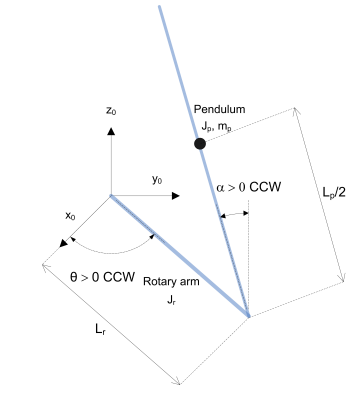
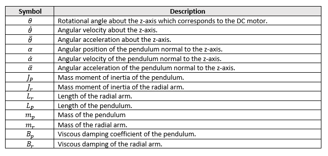

# Furuta Pendulum
## MECA 482: *Keegan Penso, Tyler Chesney, Mohit Bhardwaj, Quincy Owyang, Jack Russo*

## Introduction
**1. Background**

A Futura Pendulum is a simple Control Theroy learning tool. It is comprised of a rotating arm and a pendulum attached to the end. The model neglects friction, when considering the mass relative to the fricton of the bearings in the pendulum it is a good assumtion that the coefficient of friction is too small to significantly impact the model. A real system would include encoders for position feedback of the arms, this is achieved programmatically in the simulation.

<p align="center">

</p>

<p align="center">  
  <b>Figure 1</b>: Operational viewpoint for the pendulum.
</p>

The Operational Viewpoint serves as a physical baseline for development of the overall control system. For a clearer understanding of the control hardware required for the system and their functional configuration, a functional viewpoint has been developed. Seen below in Figure 2 is the logical/functional viewpoint.

<p align="center">
  
</p>

<p align="center">  
  <b>Figure 2</b>: Logical/functional viewpoint for the pendulum.
</p>

When used in tandem, the two viewpoints allow for a full understanding of the control system.

The modeling presented in this paper couples the two systems. As will be discussed, one degree of freedom in each system can easily be reduced to a single constant dramatically simplifying the system. Vikash Gupta puts forward a well modeled Simulink model with full state feedback covering all necessary state variables. 

The following report consists of documentation pertaining to the solution obtained by the team. In order to acheive the desired functionality a mathematic model wast obtained for the system, from there a controller architechture was devised to simulate and implement the derived mathematical model. The following report consists of documentation of the control system design process. 

**2. Resources**

Listed below are several key resources utilized by the team throughout the control system desing process (for full citation please see "References"):
   - *Control System Engineering*: 7th Edition; Norman S. Nice
   - *Mathworks MATLAB Central*: Full State Feedback of Furuta Pendulum; Vikash Gupta

## Modeling
**1. Schematic**

To appropriately model the system, a schematic diagram of the pendulum was used from Quanser[2]. This schematic defines the variables to be used in this system.

<p align="center">
  
</p>

<p align="center">  
  <b>Figure 3</b>: System schematic diagram.
</p>

The following table depicts definitions based on the above schematic for system parameters used in the derivation of the mathematical model. 

<p align="center">
  <b>Table 1</b>: Parameter definitions relevant to preparing the mathematical model for the inertia wheel pendulum.
</p>

<p align="center">
  
</p>

**2. Equation of Motion**

The mechanical system was defined by the above schematic. A mathematical model was then developed to describe the system. Lagrangian methods were employed to develop the systems equation of motion.

The first step in obtaining the system's equations of motion is to define the Lagrangian. As seen in the equations above, this is to be done by first quantifying the kinetic and potential energies of the system. The system's total kinetic energy is the summation of the kinetic energy of the pendulum arm rotating on its end, treated as a particle of mass <i>m</i><sub>1</sub> located at <i>l</i><sub>c</sub>, along with the kinetic energy of the wheel rotating around its center, of mass <i>m</i><sub>1</sub> translating a radius <i>l</i>. It should be noted that the wheel’s angular velocity, as measured by an observer fixed to the mounting table for the system, is <i>θ</i><sub>1</sub>+<i>θ</i><sub>2</sub>. The equations below define the system's total kinetic energy. 

<p align="center">
  
</p>

The final step in obtaining the system's Lagrangian equation is to define its potential energies. It has been assumed that when the angular position of the pendulum arm is 0 degrees (normal equlibrium state) the system's potential energy is 0 as well. The equations below define the potential energies within the system. 

<p align="center">
  
</p>

Finally, combining Eqs.(4, 5, 6, 7) into Eq.(1) yields the final definition of the Lagrangian for the system shown in Eq.(8) below.

<p align="center">
  
</p>

In order to obtain the equation of motion for the system, the Lagrangian is implemented into the Euler-Lagrange equation for both interacting bodies which can be seen below.

<p align="center">
  
</p>

In Eq.(9), the zero on the right hand side indicates that no external torque is being applied to the pendulum at this point. Solving and simpflifying Eqs. (9, 10) yields the results below.

<p align="center">
  
</p>

Utilizing the Euler-Lagrange approach, the above equations represent the fully-defined equations of motion for the inertia wheel pendulum. These are non-linear equations of motion, however, and must be linearized before being represented in a state space equation.

<p align="center">
  
</p>

<p align="center">
  
</p>

<p align="center">
  
</p>

**3. State Space Representation**

With the equations of motion derived for the system, the final step in acquiring the mathematical model is to represent the system in state space. Seen below are the general equations for state space representation. Note the equations have been slightly modified to fit the particular scenario of the inertia wheel pendulum.

<p align="center">
  
</p>

To represent the system in state space the phase variables must first be defined. Eqs.(15, 16) below show the system-particular state variable definitions. 

<p align="center">
  
</p>

In order to acquire the equations of motion in phase-variable form, Eqs. (11, 12) are utilized to solve for <i>θ</i><sub>1</sub> double-dot and <i>θ</i><sub>2</sub> double-dot. From here, the relationships below are applied.

<p align="center">
  
</p>

Applying these relationships yields the vector-matrix form for the state space equation. The results can be seen below.

<p align="center">
  
</p>

The final step in aquiring the complete state equation is to define the output equation. Given the context of the inertia wheel pendulum, the output equation is represented below. 

<p align="center">
  
</p>

A step-by-step documentation of the methodology surrounding the acquisition of the inertia wheel pendulum's state space equation can be found [here](https://github.com/MECA482-ReactionWheel/InertiaWheel/blob/main/images/482%20wheel%20clacs.pdf).

## Sensor Calibration

No sensor calibration was necessary for implementation.

## Controller Design & Simulation

In order to implement the equation of motion into CopelliaSIM and acheive the desired function, an appropriate controller architechture must be devised. To balance the system in the inverted upright position, the motor must act according to feedback from the encoder that tracks the degree of rotation of the pendulum arm.  

The first controller used for simulation was a full-state feedback controller seen below in Figure 4.

<p align="center">
  
</p>

<p align="center">  
  <b>Figure 4</b>: Feedback controller architecture for inertia wheel pendulum.
</p>

The step response associated with the controller in Figure 4 can be seen below.

<p align="center">
  
</p>

<p align="center">  
  <b>Figure 5</b>: Step response of feedback controller.
</p>

A PID controller was also implemented and simulated. This controller tracks system error and regulates input accordingly - this architechture can be seen below.

<p align="center">
  
</p>

<p align="center">  
  <b>Figure 6</b>: PID controller architecture for inertia wheel pendulum.
</p>

The step response associated with the controller in Figure 6 can be seen below.

<p align="center">
  
</p>

<p align="center">  
  <b>Figure 7</b>: Step response for PID controller.
</p>

The inertia wheel pendulum was also modeled in CopelliaSIM. This model can be seen below.

<p align="center">
  
</p>

<p align="center">  
  <b>Figure 8</b>: CopelliaSIM model for inertia wheel pendulum.
</p>

A video of the actual simulation can be seen [here](https://github.com/MECA482-ReactionWheel/InertiaWheel/blob/main/images/Meeting%20Controls%20-%2017%20December%202021%20(1).mp4).


## Appendix A: Simulation Code

<details open>
<summary>MATLAB Full State Feedback</summary>
<p>
  
```
clc, clear all, close all;
% Define system matrices
g = 9.81
r = 0.5
m1 = 2
m2 = 1
l = 1
lc = 0.25*l
mbar = m1*lc+m2*l
J1 = (1/3)*m1*l^2
J2 = (1/2)*m2*r^2
A = [0 1 0; mbar*g/(J2*(1-m1*lc^2+m2*l^2+J1+J2)) 0 0; -mbar*g/(J2*(1-m1*lc^2+m2*l^2+J1+J2)) 0 0]
B = [0; 1/J2+(m1*lc^2+m2*l^2+J1+J2)/(J2*(1-m1*lc^2+m2*l^2+J1+J2)); -(m1*lc^2+m2*l^2+J1+J2)/(J2*(1-m1*lc^2+m2*l^2+J1+J2))] 
C = [1 0 0];
D = 0;
check1 = A(2,1)
check2 = A(3,1)
check3 = B(2,1)
check4 = B(3,1)
% Create state space object
sys = ss(A,B,C,D);
% Check open-loop eigenvalues
E = eig(A);
% Desired closed-loop eigenvalues
P = [0, -0.5, -1.5];
% Solve for K using pole placement
K = place(A,B,P);
% Check for closed-loop eigenvalues
Acl = A-B*K;
Ecl = eig(Acl);
detAcl = det(Acl)
% Closed-loop system
syscl = ss(Acl, B, C, D);
Kr = 1/dcgain(syscl);
syscl_scaled = ss(Acl, B*Kr, C, D);
% Step response of the system
%step(syscl);
step(syscl_scaled);
%step(sys)
  
```
</p>
</details>

<details open>
<summary>MATLAB API</summary>
<p>
  
```
wheel=remApi('remoteApi'); % using the prototype file (remoteApiProto.m)
wheel.simxFinish(-1); % just in case, close all opened connections
clientID=wheel.simxStart('127.0.0.1',19999,true,true,5000,5);
w = 30;
 if (clientID>-1)
        disp('Connected to remote API server');
            %output
            [returnCode,motor_encoder]=wheel.simxGetObjectHandle(clientID,'motor_encoder',wheel.simx_opmode_blocking);
            %input
            [returnCode,encoder1]=wheel.simxGetObjectHandle(clientID,'encoder',wheel.simx_opmode_blocking);
            
            [returnCode,encoder]=wheel.simxGetJointPosition(clientID,encoder1,wheel.simx_opmode_streaming);
%           [returnCode,encoder]=wheel.simxGetIntegerParameter(clientID,encoder,wheel.simx_opmode_streaming);
        %Execute This
        %Moves forward
               
        while (1)
   [returnCode,encodernum]=wheel.simxGetJointPosition(clientID,encoder1,wheel.simx_opmode_buffer)
  %[returnCode,encoder]=wheel.simxGetIntegerParameter(clientID,encoder,wheel.simx_opmode_buffer);
 encoderout = (encodernum * (180 / 3.14))
 
%          data = '{}\n'.format(encoderout)
        
[returnCode]=wheel.simxSetJointTargetVelocity(clientID, motor_encoder, w ,wheel.simx_opmode_blocking);
             pause(0.5)
        end
        wheel.simxFinish(-1);
 end
 wheel.delete(); % call the destructor!
```
</p>
</details>

**Other simulation files can be found [here](https://github.com/MECA482-ReactionWheel/InertiaWheel/blob/main/Inertia%20Wheel.zip).**

## Appendix B: Project Documents/Video

- [**Presentation Slides**](https://github.com/MECA482-ReactionWheel/InertiaWheel/blob/main/presentationSlides.pdf)
- [**Presentation Video**](https://github.com/MECA482-ReactionWheel/InertiaWheel/blob/main/images/482presentaion%20.mp4)
- [**GitHub .pdf version**](https://github.com/MECA482-ReactionWheel/InertiaWheel/blob/main/GitHub.pdf)

## References

[1] D. Dixon, “Shared Memory Plugin For VREP /Matlab Communication,” CopelliaSim. [Online]. Available: https://forum.coppeliarobotics.com/viewtopic.php?f=9&amp;t=4157&amp;hilit=simulink.

[2] Hernández-Guzmán Victor Manuel and Silva-Ortigoza Ramón, [Automatic control with experiments](https://github.com/MECA482-ReactionWheel/InertiaWheel/blob/main/references/RWP_Paper.pdf). Cham, Switzerland: Springer, 2019. 

[3] L. Arnesto, “Object hierarchy relations | Coppeliasim (V-rep),” YouTube, 31-Jan-2020. [Online]. Available: https://www.youtube.com/watch?v=HyqD140boOw. 

[4] N. S. Nise, Control Systems Engineering. Wiley, 2015. 

[5] O. D. Montoya and W. Gil-González, [“Nonlinear analysis and control of a reaction wheel pendulum: Lyapunov-based approach,”](https://github.com/MECA482-ReactionWheel/InertiaWheel/blob/main/references/automatic%20control%20with%20experiments.pdf) Engineering Science and Technology, 
an International Journal, vol. 23, no. 1, pp. 21–29, 2020. 
