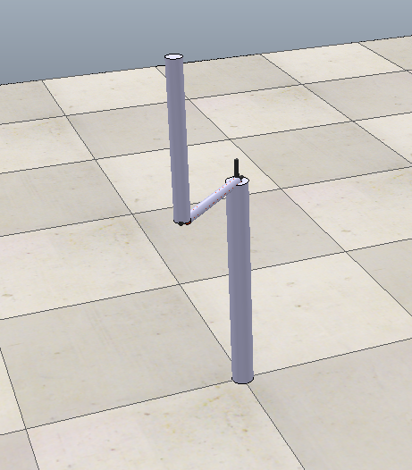

# Furuta Pendulum
## MECA 482: *Keegan Penso, Tyler Chesney, Mohit Bhardwaj, Quincy Owyang, Jack Russo*

## Introduction
**1. Background**

A Futura Pendulum is a simple Control Theroy learning tool. It is comprised of a rotating arm and a pendulum attached to the end. The model neglects friction, when considering the mass relative to the fricton of the bearings in the pendulum it is a good assumtion that the coefficient of friction is too small to significantly impact the model. A real system would include encoders for position feedback of the arms, this is achieved programmatically in the simulation.

<p align="center">

</p>

<p align="center">  
  <b>Figure 1</b>: Operational viewpoint for the pendulum.
</p>

The Operational Viewpoint serves as a physical baseline for development of the overall control system. For a clearer understanding of the control hardware required for the system and their functional configuration, a functional viewpoint has been developed. Seen below in Figure 2 is the logical/functional viewpoint.

<p align="center">
  
</p>

<p align="center">  
  <b>Figure 2</b>: Logical/functional viewpoint for the pendulum.
</p>

When used in tandem, the two viewpoints allow for a full understanding of the control system.

The modeling presented in this paper couples the two systems. As will be discussed, one degree of freedom in each system can easily be reduced to a single constant dramatically simplifying the system. Vikash Gupta puts forward a well modeled Simulink model with full state feedback covering all necessary state variables. 

The following report consists of documentation pertaining to the solution obtained by the team. In order to acheive the desired functionality a mathematic model wast obtained for the system, from there a controller architechture was devised to simulate and implement the derived mathematical model. The following report consists of documentation of the control system design process. 

**2. Resources**

Listed below are several key resources utilized by the team throughout the control system desing process (for full citation please see "References"):
   - *Control System Engineering*: 7th Edition; Norman S. Nice
   - *Mathworks MATLAB Central*: Full State Feedback of Furuta Pendulum; Vikash Gupta

## Modeling
**1. Schematic**

To appropriately model the system, a schematic diagram of the pendulum was used from Quanser[2]. This schematic defines the variables to be used in this system.

<p align="center">
  
</p>

<p align="center">  
  <b>Figure 3</b>: System schematic diagram.
</p>

The following table depicts definitions based on the above schematic for system parameters used in the derivation of the mathematical model. 

<p align="center">
  <b>Table 1</b>: Parameter definitions relevant to preparing the mathematical model for the inertia wheel pendulum.
</p>

<p align="center">
  
</p>

<p align="center">
  <b>Table 2</b>: Parameter definitions relevant to preparing the mathematical model for motor torque.
</p>

<p align="center">
  
</p>

**2. Equation of Motion**
Equations of motion for the pendulum system are derived using the Lagrange method. Two equations of motion are required for the system, one that describes the motion of the arm and another that describes the motion of the pendulum with respect to motor voltage.

<p align="center">
  
</p>

In equation one, the variable qi is a generalized coordinate. In this system, its value and the value of its derivative are given by the following arrays.

<p align="center">
  
</p>

Substituting the values of the generalized coordinates into equation one gives the Euler-Lagrange equations for the system.

<p align="center">
  
</p>

The Lagrangian of the system is described by the following equation, where T is the total kinetic energy of the system and V is the total potential energy of the system.

<p align="center">
  
</p>

The generalized forces acting on the rotary arm and the pendulum are torque and viscous damping (friction) and torque. They are given by the equations below.

<p align="center">
  
</p>

The torque of the motor is described by the following equation.

<p align="center">
  
</p>

Given that, the non-linear equations of motion are given by the following equations. 

<p align="center">
  
</p>

The right-hand side of each equation is already linear, so they can be substituted with f(z), where z is an array of the system state variables as follows.

<p align="center">
  
</p>

All system state variables are set to 0 for linearization. The linearized functions are in the following form.

<p align="center">
  
</p>

Solving for the terms of the linearized function for equation ten yields the linearized form of the first equation of motion.

<p align="center">
  
</p>

Solving for the terms of the linearized function for equation ten yields the linearized form of the first equation of motion.

<p align="center">
  
</p>

This process is repeated for the second equation of motion.

<p align="center">
  
</p>

**3. State Space Representation**

With the equations of motion derived for the system, the final step in acquiring the mathematical model is to represent the system in state space. Seen below are the general equations for state space representation. Note the equations have been slightly modified to fit the particular scenario of the inertia wheel pendulum.

<p align="center">
  
</p>

To represent the system in state space the phase variables must first be defined. Eqs.(15, 16) below show the system-particular state variable definitions. 

<p align="center">
  
</p>

In order to acquire the equations of motion in phase-variable form, Eqs. (11, 12) are utilized to solve for <i>θ</i><sub>1</sub> double-dot and <i>θ</i><sub>2</sub> double-dot. From here, the relationships below are applied.

<p align="center">
  
</p>

Applying these relationships yields the vector-matrix form for the state space equation. The results can be seen below.

<p align="center">
  
</p>

The final step in aquiring the complete state equation is to define the output equation. Given the context of the inertia wheel pendulum, the output equation is represented below. 

<p align="center">
  
</p>

## Sensor Calibration

No sensor calibration was necessary for implementation.

## Controller Design & Simulation

In order to implement the equation of motion into CopelliaSIM and acheive the desired function, an appropriate controller architechture must be devised. To balance the system in the inverted upright position, the motor must act according to feedback from the encoder that tracks the degree of rotation of the pendulum arm.  

The control architecture was found from Gupta's implementation [1] in combination with Quanser manthematics. Architecture that was implemented is shown in the figure below.

<p align="center">
  
</p>

<p align="center">  
  <b>Figure 4</b>: Feedback controller architecture.
</p>

The step response associated with the controller in Figure 4 can be seen below.

<p align="center">
  
</p>

<p align="center">  
  <b>Figure 5</b>: Step response of feedback controller.
</p>

The pendulum was also modeled in CopelliaSim in the manner shown below. Unfortunately the simulation was not sucessfully implemented. 

<p align="center">
  
</p>

<p align="center">  
  <b>Figure 8</b>: CopelliaSim model forthe Furuta Pendulum.
</p>


## Appendix A: Simulation Code

<details open>
<summary>MATLAB Full State Feedback</summary>
<p>
  
```
%% List of parameters

L_r = 0.36; %length of radial arm
L_p = 0.58; %length of the pendulum
m_p = 0.31; %mass of pendulum (kg)
m_r = 0.53; %mass of the radial arm.
B_p = 0.025; %damping of the pendulum.
B_r = 0.01; %damping of the radial arm.
fre = 0.1; %the frequency of the sin wave input

J_r=((m_r+m_p)*L_r^2)/3;
J_p=(m_p*L_p^2)/3;
J_T=J_p*m_p*L_r^2+J_r*J_p+0.25*J_r*m_p*L_p^2;
g=9.81; % gravity

%% Matrices

A=[0 0 1 0;
   0 0 0 1;
   0 0.25*m_p^2*L_p^2*L_r*g -(J_p+0.25*m_p*L_p^2)*B_r -0.5*m_p*L_p*L_r*B_p;
   0 0.5*m_p*L_p*g*(J_r+m_p*L_r^2) 0.5*m_p*L_p*L_r*B_r -(J_r+m_p*L_r^2)*B_p];

B=1/J_T*[0;0;J_p+0.25*m_p*L_p^2;0.5*m_p*L_p*L_r];

C=[1 0 0 0;
    0 1 0 0];
D=[0;0;0;0];

P=[-17.1 8.34 -2.87 0];

K=acker(A,B,P);

%tout=0:0.1:30;
subplot(4,1,1)

plot(tout,yout(:,1)*180/pi);grid on;
xlabel('Time');ylabel('\alpha');

subplot(4,1,2)

plot(tout,yout(:,2)*180/pi);grid on;
xlabel('Time');ylabel('\dot{\alpha}');

subplot(4,1,3)

plot(tout,yout(:,3)*180/pi);grid on;
xlabel('Time');ylabel('\theta');

subplot(4,1,4)

plot(tout,yout(:,4)*180/pi);grid on;
xlabel('Time');ylabel('\dot{\theta}');
  
```
</p>
</details>

<details open>
<summary>MATLAB API</summary>
<p>
  
```
wheel=remApi('remoteApi'); % using the prototype file (remoteApiProto.m)
wheel.simxFinish(-1); % just in case, close all opened connections
clientID=wheel.simxStart('127.0.0.1',19999,true,true,5000,5);
w = 30;
 if (clientID>-1)
        disp('Connected to remote API server');
            %output
            [returnCode,motor_encoder]=wheel.simxGetObjectHandle(clientID,'motor_encoder',wheel.simx_opmode_blocking);
            %input
            [returnCode,encoder1]=wheel.simxGetObjectHandle(clientID,'encoder',wheel.simx_opmode_blocking);
            
            [returnCode,encoder]=wheel.simxGetJointPosition(clientID,encoder1,wheel.simx_opmode_streaming);
%           [returnCode,encoder]=wheel.simxGetIntegerParameter(clientID,encoder,wheel.simx_opmode_streaming);
        %Execute This
        %Moves forward
               
        while (1)
   [returnCode,encodernum]=wheel.simxGetJointPosition(clientID,encoder1,wheel.simx_opmode_buffer)
  %[returnCode,encoder]=wheel.simxGetIntegerParameter(clientID,encoder,wheel.simx_opmode_buffer);
 encoderout = (encodernum * (180 / 3.14))
 
%          data = '{}\n'.format(encoderout)
        
[returnCode]=wheel.simxSetJointTargetVelocity(clientID, motor_encoder, w ,wheel.simx_opmode_blocking);
             pause(0.5)
        end
        wheel.simxFinish(-1);
 end
 wheel.delete(); % call the destructor!
```
</p>
</details>

**Other simulation files can be found [here](https://github.com/MECA482-ReactionWheel/InertiaWheel/blob/main/Inertia%20Wheel.zip).**

## Appendix B: Project Documents/Video

- [**Presentation Slides**](https://github.com/t-ches-csuc/MECA482-Furuta_Pendulum/tree/main/misc/Furuta%20Pendulum%20Presentation.pdf)
- [**Presentation Video**](https://github.com/MECA482-ReactionWheel/InertiaWheel/blob/main/images/482presentaion%20.mp4)
- [**GitHub .pdf version**](https://github.com/t-ches-csuc/MECA482-Furuta_Pendulum/blob/main/misc/t-ches-csuc_MECA482-Furuta_Pendulum.pdf)

## References

[1] Vikash Gupta (2019). Full State Feedback of Furuta Pendulum (https://www.mathworks.com/matlabcentral/fileexchange/25585-full-state-feedback-of-furuta-pendulum), MATLAB Central File Exchange. Retrieved May 19, 2022.

[2] Jacob Apkarian, Michel Lévis and Hakan Gurocak, [Inverted Pendulum Experiment, Student Workbook](https://github.com/t-ches-csuc/MECA482-Furuta_Pendulum/blob/main/misc/Rotary%20Pendulum%20Workbook%20(Student).pdf). Ontario, Canada: Quanser, 2011. 

[3] Jacob Apkarian, Michel Lévis and Hakan Gurocak, [SRV02 Rotary Servo Base Unit User Manual](https://nps.edu/documents/105873337/0/SRV02+Base+Unit+User+Manual.pdf/ce50a48e-d169-4652-a9df-ae979af10094?t=1441916178000). Ontario, Canada: Quanser, 2011. 
